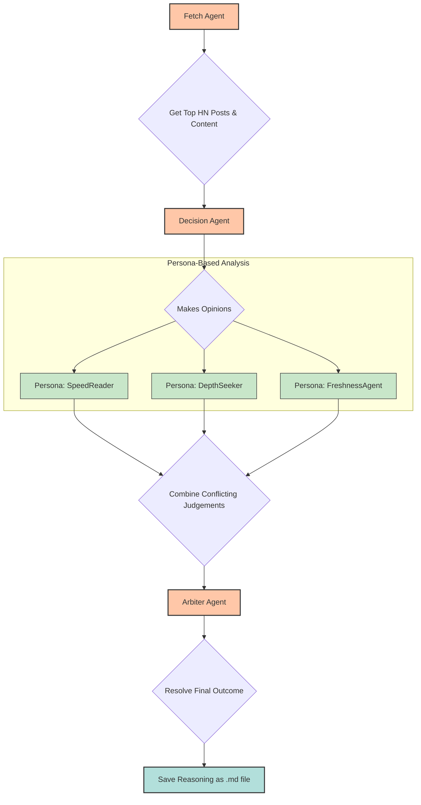

# Multi-Agent News Analysis with Debate

A sophisticated multi-agent system that analyzes Hacker News articles using three AI agents with different personas, followed by inter-agent debate and final arbitration.

## Features

- **Content Extraction**: Uses BeautifulSoup to extract actual article content
- **Multi-Agent Analysis**: 3 agents with different perspectives (SpeedReader, DepthSeeker, FreshnessAgent)
- **Inter-Agent Debate**: Agents respond to each other's arguments and defend positions
- **Deep Reasoning**: Step-by-step reasoning chains with confidence scores
- **Final Arbitration**: Arbiter weighs all evidence for final decision
- **Rich Output**: Detailed markdown reports with full reasoning transparency

## Setup

### 1. Install Ollama
```bash
# macOS
brew install ollama

# Linux
curl -fsSL https://ollama.ai/install.sh | sh

# Windows - download from https://ollama.ai
```

### 2. Pull the required model
```bash
ollama pull llama3.2
```

### 3. Start Ollama server
```bash
ollama serve
```

### 4. Install Python dependencies
```bash
pip install -r requirements.txt
```

### 5. Run the analysis
```bash
python main.py
```

## Configuration

- **OLLAMA_URL**: Set to your Ollama server URL (default: http://localhost:11434)
- **Model**: Currently uses `llama3.2` - change in agent files if needed

## Output

The system generates detailed markdown reports in the `outputs/` directory showing:

1. **Phase 1**: Initial agent decisions with reasoning chains
2. **Phase 2**: Inter-agent debate responses and arguments
3. **Phase 3**: Final arbiter decision with evidence analysis

## System Flow

Here is a diagram illustrating the step-by-step flow of the system:


